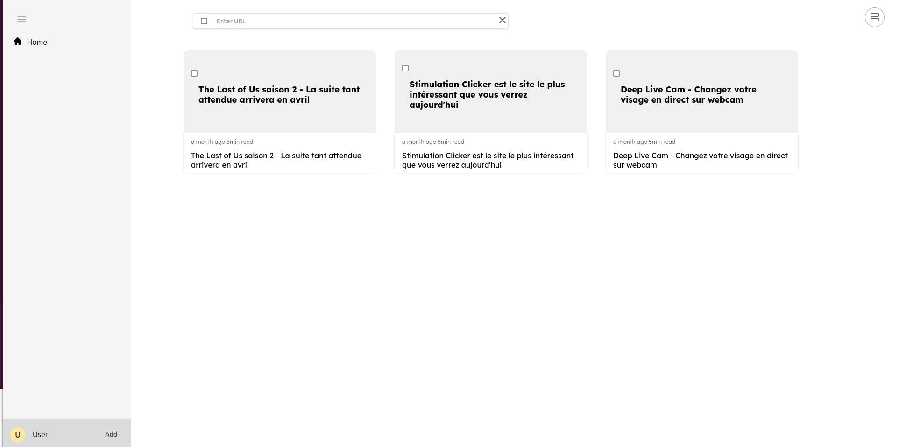
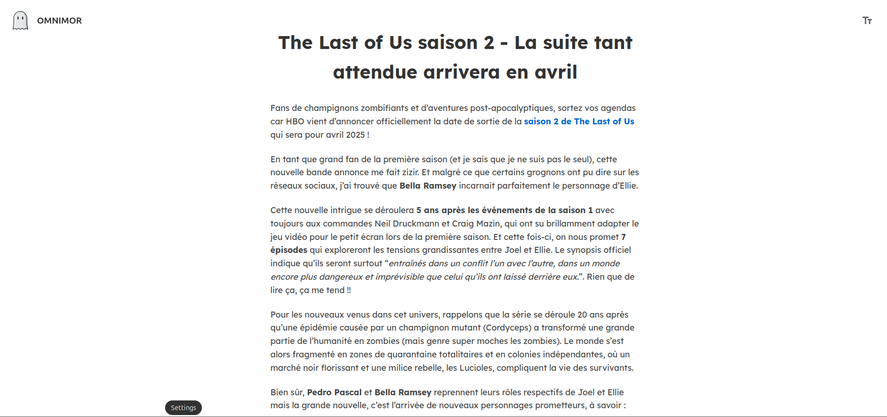
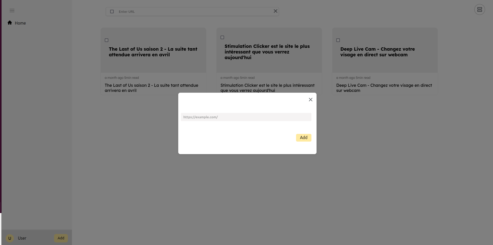

# KeepUp - Your Personal Web Article Manager


## Overview
KeepUp is a self-hosted web article management solution born from the sunset of Omnivore. It aims to provide a seamless experience for saving, and reading web articles.

## Screenshots

<!-- Method 1: Local images in your repository -->





## Key Features
- 📑 Save articles from any URL
- 🎯 Clean reading experience
- 📱 Responsive grid and list views
- 🗑️ Easy article management
- 🔍 Full-text search (coming soon)
- 🏷️ Tags and categories (coming soon)

## Tech Stack

### Frontend
- React.js for the UI
- Axios for API communication
- CSS Modules for styled components

### Backend
- Node.js & Express.js
- PostgreSQL database
- @mozilla/readability for article parsing
- JSDOM for HTML processing

## Getting Started

### Prerequisites
- Node.js (v14 or higher)
- PostgreSQL (v12 or higher)
- npm or yarn

### Database Setup
1. Create a new PostgreSQL database
2. Set up the articles table:
```sql
CREATE TABLE articles (
id SERIAL PRIMARY KEY,
title VARCHAR(255),
link TEXT
);
```


### Configuration du Backend
### Backend Setup
1. Navigate to the `keepUpAPI` directory
2. Create a `.env` file with your database credentials:
```
DB_USER=votre_utilisateur
DB_HOST=localhost
DB_NAME=nom_de_votre_base
DB_PASSWORD=votre_mot_de_passe
DB_PORT=5432
```
3. Install dependencies:
```bash
npm install
```
4. Start the server:
```bash
npm start
```


## Usage Guide
1. Launch the application
2. Click the "Add" button in the sidebar
3. Paste any article URL to save it
4. Browse your articles in grid or list view
5. Click on any article to open the reader view
6. Use the toolbar for article management

## Project Structure
keepUp/
│
├── keepUpApp/           # Frontend React
│   ├── public/         
│   │   └── assets/     # Assets
│   └── src/
│       └── components/ # React Components and CSS Files
│
└── keepUpAPI/          # Backend Express
    ├── routes/         # API Routes
    └── config/         # Configuration

## Contribution
Contributions are welcome! Feel free to:
- Report bugs
- Suggest new features
- Contribute to the code
## Licence
Ce projet est sous licence MIT - voir le fichier LICENSE pour plus de détails.

## Auteur
KeepUp - 2025
